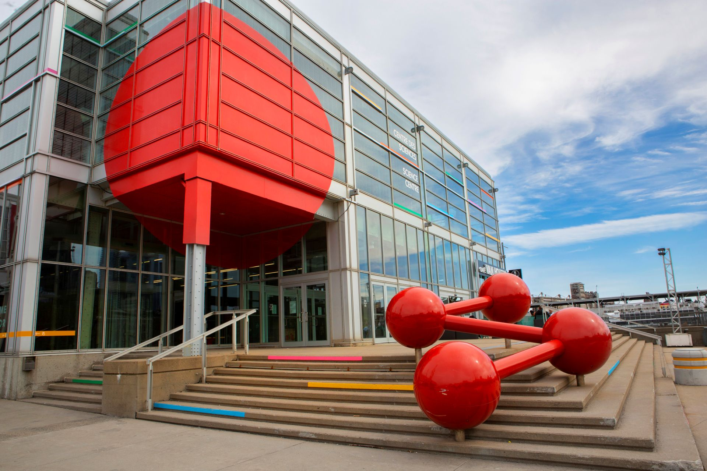
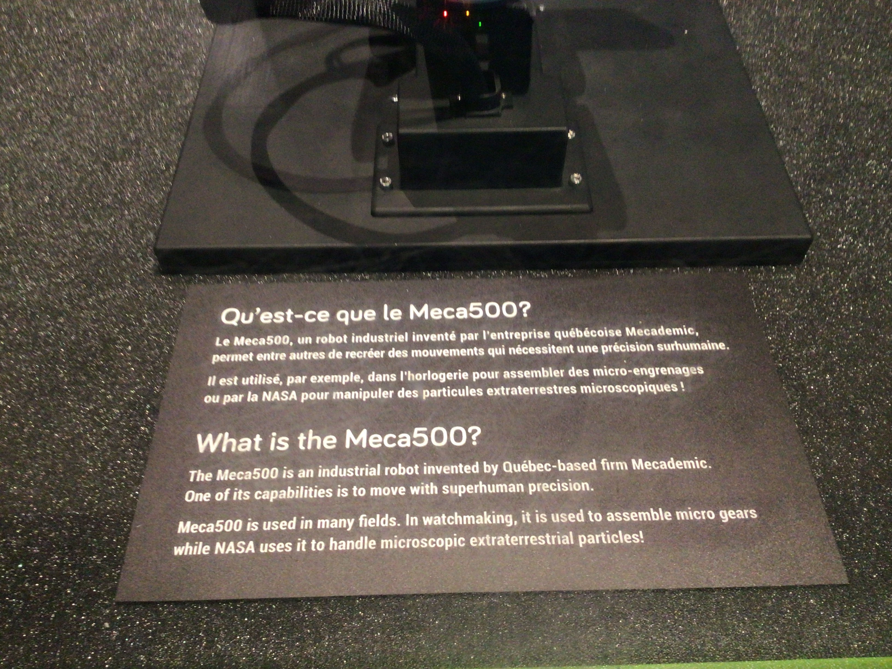
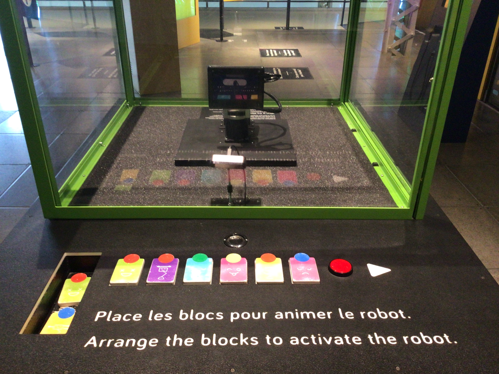
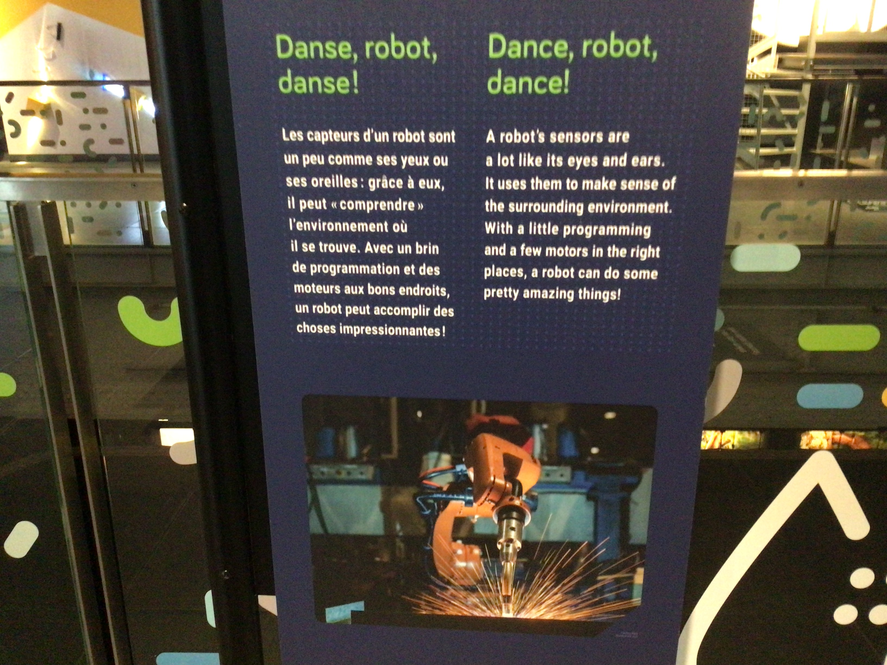

# Exposition Danse, Robot, Danse!

**Centre des sciences de Montréal**

> Photo en face du Centre des sciences de Montréal

*(Exposition permantente et intérieur)*

*Date de visite : 1 avril 2026*

## Danse, Robot, Danse!

Date de réalisation: 21 juillet 2021

### Description de l'oeuvre

Danse, Robot, Danse! est une installation interactive du Centre des sciences de Montréal où un petit robot, le Meca500, exécute une danse créée par les visiteurs. En plaçant des blocs colorés devant lui, le public déclenche différents mouvements et expressions que le robot reproduit grâce à une caméra qui interprète les couleurs. L'oeuvre met en valeur la précision, la compaccité et l'ingénieurie montréalaise derrière ce robot.

Type d'installation: intéractive

> Photo de l'oeuvre

### Mise en espace:

> Croquis de l'oeuvre

Élément nécessaires à la mise en exposition: 

- vitrine transparente
- table
- panneau

### Composantes et techniques

- robot Meca500
- blocs colorés
- caméra
- haut-parleur

### Expérience vécue

L’expérience est interactive, simple et ludique. En tant que visiteur, on est invité à choisir et placer des blocs colorés devant le robot. Dès que la caméra détecte la combinaison, le Meca500 exécute une petite chorégraphie correspondant aux couleurs choisies.
On ressent une impression de précision, de réactivité et même une forme de personnalité du robot, malgré sa taille minuscule.
L’installation donne envie d’expérimenter, de tester différentes combinaisons et d’observer comment le robot réagit. C’est une expérience à la fois scientifique, créative et amusante, qui rend la robotique accessible.

### Appréciation

J’ai beaucoup apprécié Danse, Robot, Danse! parce que l’installation réussit à rendre la robotique accessible, amusante et interactive. Le fait de pouvoir influencer les mouvements du robot grâce aux blocs colorés crée un sentiment de participation et de contrôle qui rend l’expérience engageante. Le Meca500, malgré sa petite taille, impressionne par sa précision et sa fluidité, ce qui montre bien l’avancée technologique derrière l’œuvre.

L’installation est aussi bien présentée : la vitrine, l’éclairage et l’espace autour permettent d’observer le robot clairement et de comprendre son fonctionnement. L’œuvre réussit à combiner science, jeu et découverte, ce qui la rend intéressante autant pour les jeunes que pour les adultes. Elle donne envie d’en apprendre davantage sur la robotique et sur la manière dont les machines peuvent interagir avec nous.

### Références

> Photo du batiment : [Centre des sciences de Montréal extérieur](https://tickets.vieuxportdemontreal.com/WebStore/landingPage?cg=CSM&language=1)

