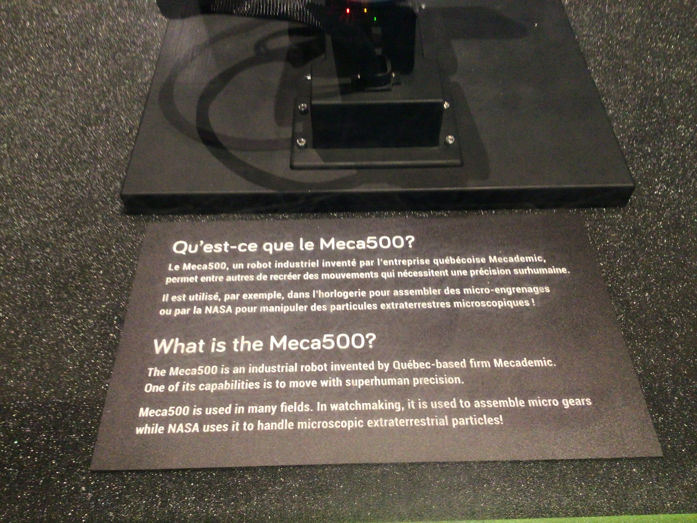
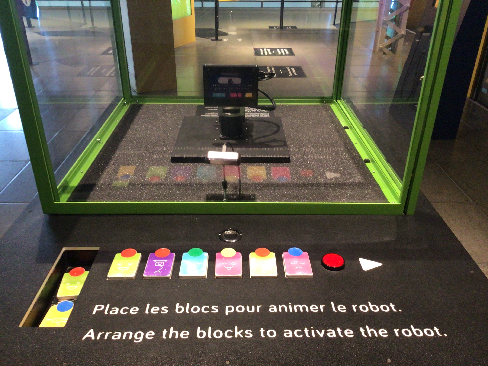

# Exposition Danse, Robot, Danse!

**Centre des sciences de Montréal**

> Photo en face du Centre des sciences de Montréal

*(Exposition permantente et intérieur)*

*Date de visite : 1 avril 2026*

## Danse, Robot, Danse!

Date de réalisation: 21 juillet 2021

### Description de l'oeuvre

Type d'installation: intéractive

> Photo de l'oeuvre

### Mise en espace:

> Croquis de l'oeuvre

Élément nécessaires à la mise en exposition: 

### Composantes et techniques

### Expérience vécue

### Appréciation

### Références

> Photo du batiment : [Centre des sciences de Montréal extérieur](https://tickets.vieuxportdemontreal.com/WebStore/landingPage?cg=CSM&language=1)

