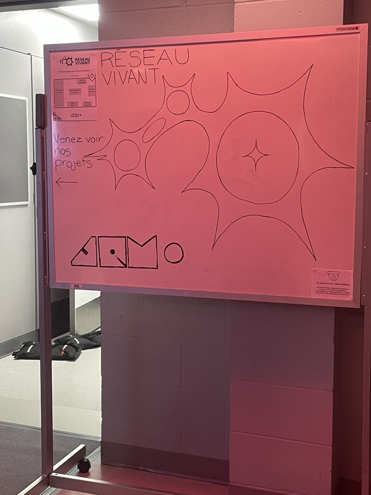
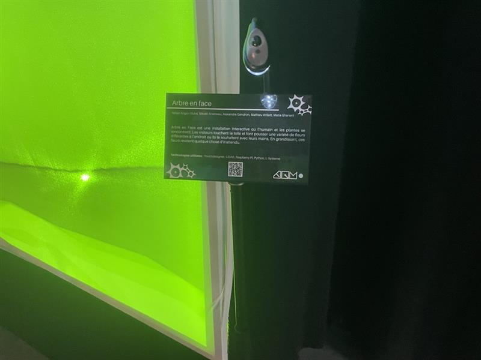
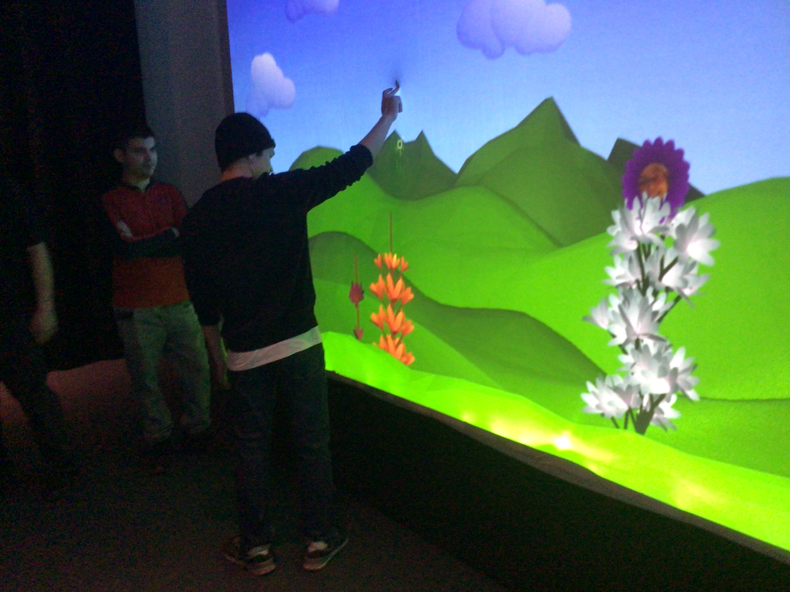
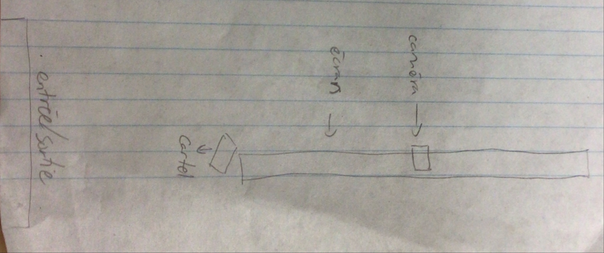

# Exposition Réseau vivant

**Studio TIM au collège Montmorency**

> Photo en face du studio TIM

*(Exposition temporaire et intérieur)*

*Date de visite : 17 mars 2026*

## Arbre en Face

**Par Alexandre Gendron, Mikael Arseneau, Mathieu Willett, Matis Ghariani et Rafael Angon Dube**

Date de réalisation: 2025

### Description de l'oeuvre

Arbre en Face est une installation où les personnes peuvent intéragir avec la nature avec une touche d'humour. Les participants doivent traîner leur doigt sur la toile pour pousser des fleurs ou des arbres. Chaque centre de fleur est accompagné par le visage d'un participant. Cet oeuvre veut promouvoir l'équilibre et l'exccès, la solidarité et la responsabilité collective pour nous encourager à faire plus attention au monde végétal.

Type d'installation: immersive

> Photo de l'oeuvre

### Mise en espace:

> Croquis de l'oeuvre

Élément nécessaires à la mise en exposition: 

- support + cartel

### Composantes et techniques
Ordinateur de l'école, 2 moniteurs, clavier, souris, 2 haut-parleurs, caméra pour ordinateur, 1-2 lidars, 1-2 projecteurs, toile de spendax, 40 pinces pour la toile, 4 trépieds, bc204, 4 multiprises électriques, 6 rallonges électrique, 4 rouleaus de velcro pour fils, 6 cable Ethernet, transmetteur Cat6, 5 cables HDMI, 3 cable XLR, 4 cables USB, 2 cable Display Port, sacs de sable (quantité non mentionné), bois (quantité non mentionné).

### Expérience vécue

J'ai traîné mon doigt sur la toile et une plante est apparu avec un petit son et un visage random. J'ai refait la même chose à un endroit différent de l'écran et une plante différente est apparu avec un autre visage. J'ai touché un nuage et un arc-en-ciel est apparu. J'ai touché un autre nuage et un autre visage est apparu.

### Appréciation

J'ai aimé qu'il y avait une diversité des plantes et chacuns avaient un petit son différent quand elles apparaissaient. Il y avait des tailles et des espèces différentes. Ceraines plantes n'avaient pas de visages, ce qui faisait l'intéraction encore plus le fun parce qu'on ne savait pas quand on allé voir une autre face. J'ai aimé qu'on pouvait aussi intéragir avec des nuages pour rendre l'intéraction plus intérressante. Chaque nuages avaient une animation différente: un faisait apparaître un ar-en-ciel tandis qu'un autres faisait apparaitre un autre visage.

Ce que j'aurais amélioré c'est faire en sorte que se ne soit pas trop long pour faire pousser les plantes. Il fallait traîner son doigt plusieurs fois sur la toile pour faire pousser une seule plante.

### Références

> Photo du lieu d'exposition + cartel : Aline Teresa Manoukian

> Informations sur l'oeuvre : [composantes et techniques](https://mammouths.github.io/projet/#/technique/)

