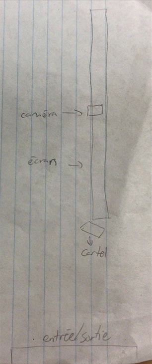

# Exposition Réseau vivant

**Studio TIM au collège Montmorency**

> Photo en face du studio TIM

*(Exposition temporaire et intérieur)*

*Date de visite : 17 mars 2026*

## Arbre en Face

**Par Alexandre Gendron, Mikael Arseneau, Mathieu Willett, Matis Ghariani et Rafael Angon Dube**

Date de réalisation: 2025

### Description de l'oeuvre

Type d'installation: immersive

> Photo de l'oeuvre

### Mise en espace:

> Croquis de l'oeuvre

Élément nécessaires à la mise en exposition: 

- lumières + herse d'accrochage

- support + cartel

### Composantes et techniques

### Expérience vécue

### Appréciation

### Références

