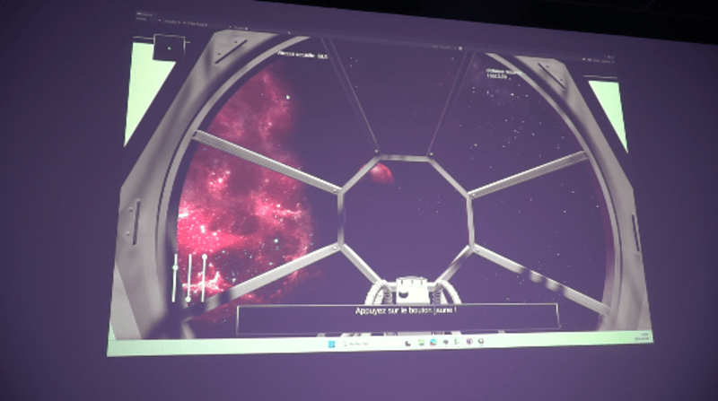
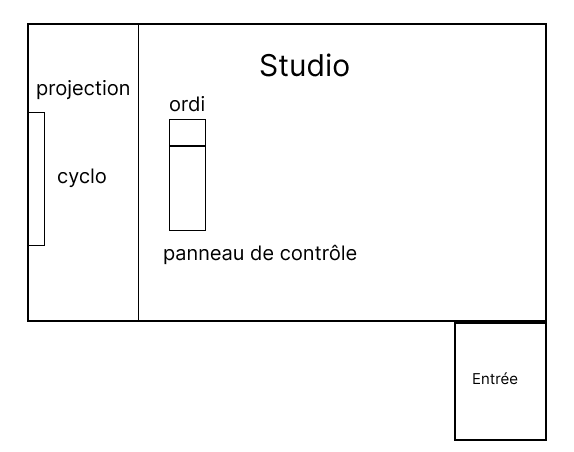
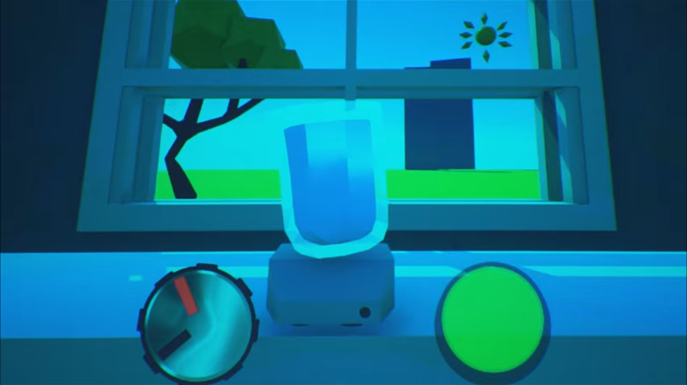
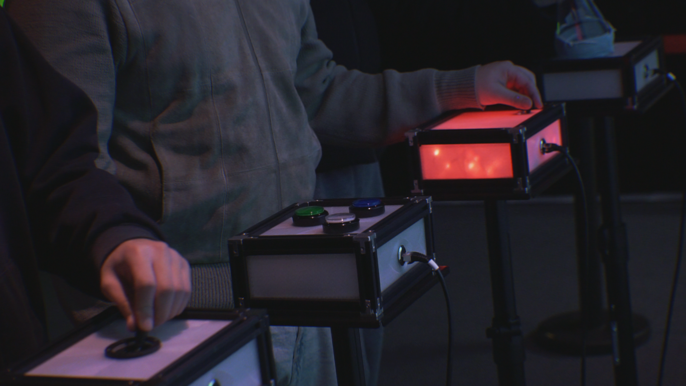

*Ce fichier contient les autres projets en ordre de préférence.*

# 1) Mission Décollage

## Équipe:
- Ahmed Kaissoumi
- Radhouane Kordan
- Justin Montpetit
- Thearylou Lach
- Justin Saloumi

## Installation en cours

> Photos prise du GitHub Mission

### Schéma de l'installation

> Croquis de l'installation Mission

## Éxpériance

Avant: J'étais très intérréssée de l'idée 

Après: J'ai du faire plusieurs essais avec mes amies pour comprendre quels boutons activer et désactiver et à quel moment. Même s'il y avait une feuille de note avec le rôle de chaque boutons devant nous et l'aide d'un des membres de l'équipe qui à fait l'oeuvre, on avait presque pas de temps de réaction puisque le jeu était très rapide. Cependant, c'est cette adrénaline qui nous a poussé à ne pas abandonner et à recommecer trois à quatre fois pour enfin réussir. C'était juste une question d'équipe. J'ai vraiment aimé cette oeuvre.

# 2) Terminal

## Équipe:
- Émeryk Béslile
- Elie Daher
- Ting Yung Lu Terry
- Danna Saavedra-Torrano
- Mégane Ranger

## Installation 

> Photo prise du GitHub Terminal

### Schéma de l'installation en cours

> Croquis de l'installation Terminal

## Éxpériance

Avant:

Après:

# 3) Symbiose

## Équipe:
- Yannick Chamberland
- Benjamin Ferland
- Ryan Dufault
- Walid Cheour

## Installation en cours

> Photos prise du GitHub Symbiose (la photo de l'écran est prise de la bande-annonce à 0:25 secondes)

#### Schéma de l'installation

> Croquis de l'installation Symbiose

## Éxpériance

Avant: Je trouvais l'oeuvre plutôt intéressante puisqu'il fallait réussir à faire une potion et la maintenir le plus longtemps possible. Je pensais que ça aller être mon oeuvre préférée puisqu'il avait l'air facile, mais qui nécéssité  de la rapidité.

Après: J'étais devenue frustrée quand on (moi et mes amies) "échouait". On suivait tous les étapes demandées à la lettre et avec une bonne rapidité, mais après maximum deux minutes, on recevait un message d'échec.

# 4) Océan Rouge

## Équipe:
- Amira Tounerkti
- Kristy Moussally

## Installation en cours

> Photo prise du GitHub Océan Rouge

### Schéma de l'installation

> Croquis de l'installation Océan Rouge plan de face

> Croquis de l'installation Océan Rouge plan de côté
> 
## Éxpériance

Avant: Je trouvais le projet plutôt simple à jouer puisqu'il fallait juste bouger la manette de gauhe à droite, la tourner et appuyer le bouton dessus. Je pensais que j'allais le réussir haut la main.

Après: Je trouvais l'oeuvre difficile puisque les déchets arrivaient vite et avec un manque de vue de 360 degrés, c'était très difficile de réussir à asprier tous les déchets à temps.

# 5) Quand les yeux se croisent

## Équipe:
- Patricia Nassif
- Jade Hébert
- Manel Yaya
- Edelwyn Ledru
- Félix Lavoie

## Installation en cours

> Photo prise du GitHub Quand les yeux se croisent

### Schéma de l'installation

> Croquis de l'installation Quand les yeux se croisent

## Éxpériance

Avant: À cause du manque de vidéo bande-annonce sur le GitHub, je devais me référer à la description de l'oeuvre. Je n'avait pas vraiment d'attentes pour cette oeuvre puisque je savais qu'il n'y aura pas vraiment d'intéractions intérressantes.

Après: Comme je le pensais avant la visite, cette oeuvre serait la moins intérresante à cause d'un manque d'intéractivité. On ne faisait que rester sur place sur des empreintes comme si je prenais une photo et c'est tout. L'installation était belle, mais il n'y avait rien à faire.

# Références
**Tous les photos et croquis ont été prises des GitHubs de chaque oeuvres.**

## Mission

[Photos GitHub Mission Décollage](https://o-i-g-n-o-n.github.io/Mission-decollage/#/presse/)
> Photos prises du GitHub de l'oeuvre Mission Décollage

[Croquis GitHub Mission Décollage](https://o-i-g-n-o-n.github.io/Mission-decollage/#/technique/)
> Croquis pris du GitHub de l'oeuvre Mission Décollage

## Terminal

[Photos GitHub Terminal](https://pythons-5.github.io/Terminal/#/presse/)
> Photos prises du GitHub de l'oeuvre Terminal

[Croquis GitHub Terminal](https://les-chimistes.github.io/symbiose/#/technique/)
> Croquis pris du GitHub de l'oeuvre Terminal

## Symbiose

[Photos GitHub Symbiose](https://les-chimistes.github.io/symbiose/#/presse/)
> Photos prises du GitHub de l'oeuvre Symbiose
> La photo de l'écran est prise de la bande-annonce à 0:25 secondes

[Croquis GitHub Symbiose](https://pythons-5.github.io/Terminal/#/technique/)
> Croquis pris du GitHub de l'oeuvre Mission

## Océan Rouge

[Photos GitHub Océan Rouge](https://deux-intelligence.github.io/deux-neurones/#/)
> Photos prises du GitHub de l'oeuvre Océan Rouge

[Croquis GitHub Océan Rouge](https://deux-intelligence.github.io/deux-neurones/#/technique/)
> Croquis pris du GitHub de l'oeuvre Mission

## Quand les yeux se croisent

[Photos GitHub Quand les yeux se croisent](https://emersiaa.github.io/Quand-les-yeux-se-croisent/#/)
> Photos prises du GitHub de l'oeuvre Quand les yeux se croisent

[Croquis GitHub Quand les yeux se croisent](https://emersiaa.github.io/Quand-les-yeux-se-croisent/#/technique/)
> Croquis pris du GitHub de l'oeuvre Mission
