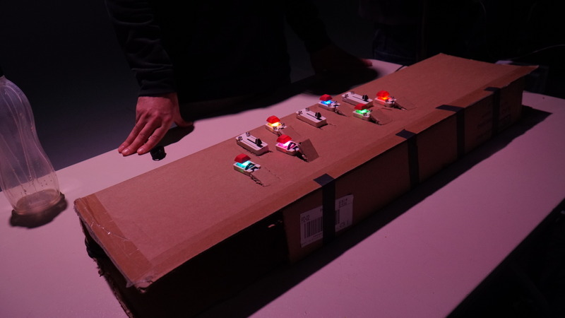
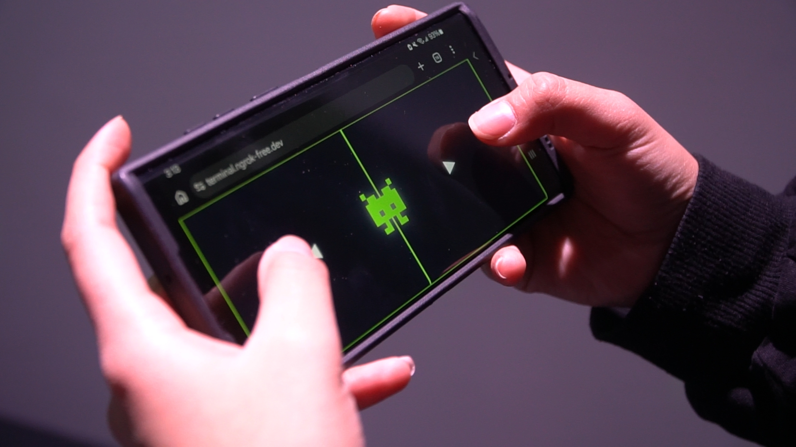
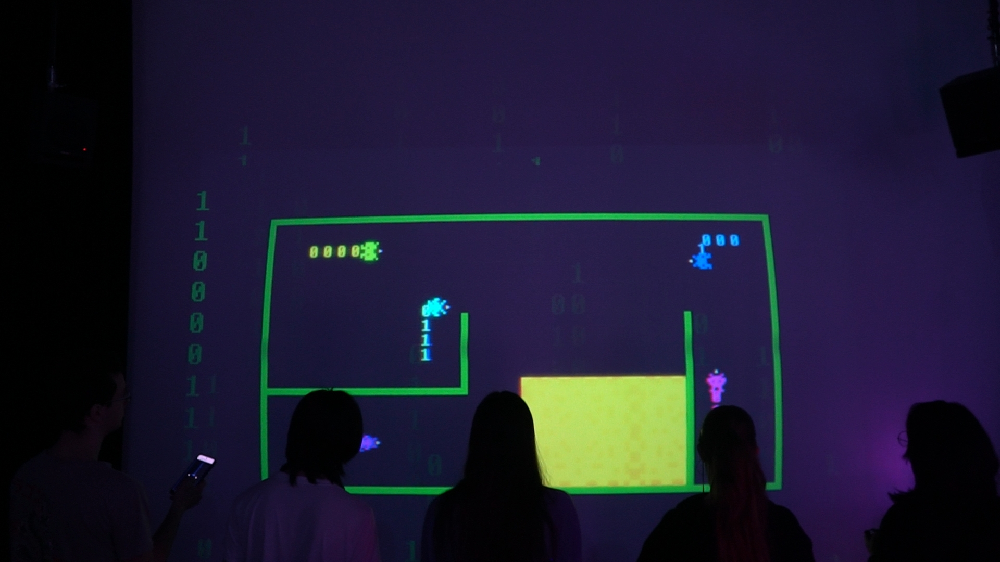

*Ce fichier contient les autres projets en ordre de préférence.*

# 1) Terminal

## Équipe:
- Émeryk Béslile
- Elie Daher
- Ting Yung Lu Terry
- Danna Saavedra-Torrano
- Mégane Ranger

## Installation finale

> Photos prise du GitHub

Schéma de l'installation

> Schéma fait par Eliza Tomoiaga

## Éxpériance

# 2) Mission

## Équipe:
- Ahmed Kaissoumi
- Radhouane Kordan
- Justin Montpetit
- Thearylou Lach
- Justin Saloumi

## Installation finale

> Photo prise du GitHub

Schéma de l'installation

> Schéma fait par Eliza Tomoiaga

## Éxpériance

# 3) Quand les yeux se croisent

## Équipe:
- Patricia Nassif
- Jade Hébert
- Manel Yaya
- Edelwyn Ledru
- Félix Lavoie

## Installation finale

> Photo prise du GitHub

Schéma de l'installation

> Schéma fait par Eliza Tomoiaga

## Éxpériance

# 4) Symbiose

## Équipe:
- Yannick Chamberland
- Benjamin Ferland
- Ryan Dufault
- Walid Cheour

## Installation finale

> Photo prise du GitHub

Schéma de l'installation

> Schéma fait par Eliza Tomoiaga

## Éxpériance

# 5) Océan Rouge

## Équipe:
- Amira Tounerkti
- Kristy Moussally

## Installation finale

> Photo prise du GitHub

Schéma de l'installation

> Schéma fait par Eliza Tomoiaga

## Éxpériance

