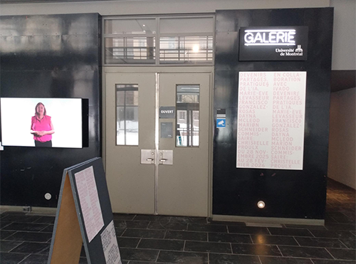
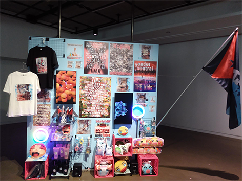
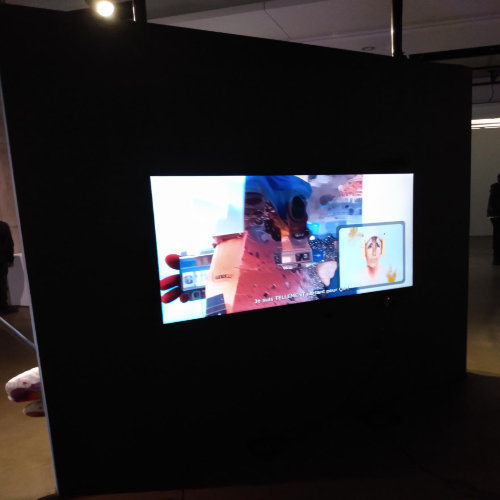
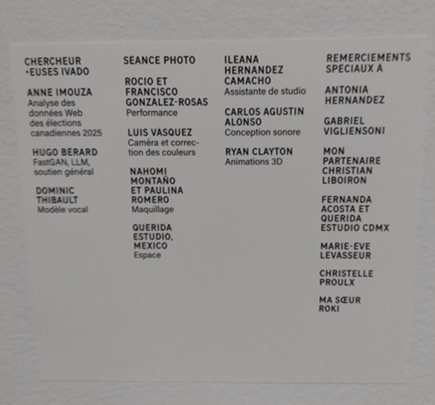
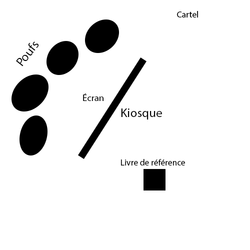
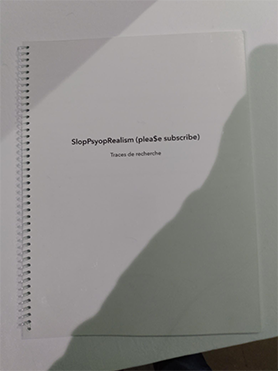
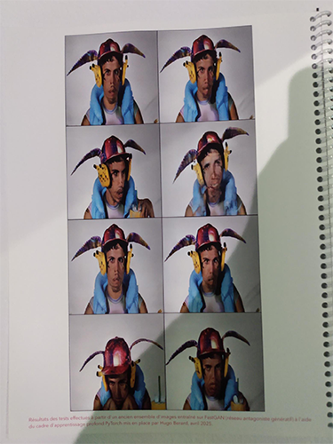
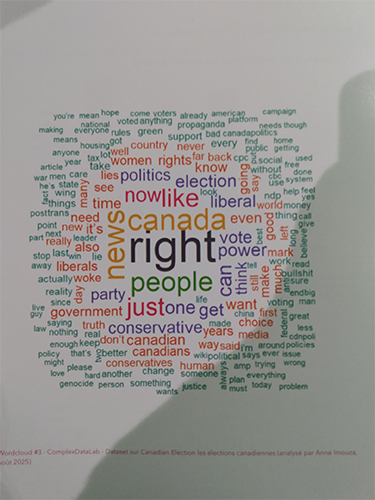
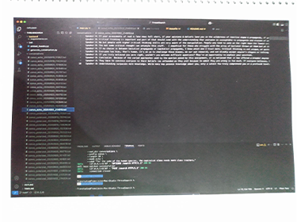

# Exposition Devenir 

**Galerie de l'Université de Montréal**

*(Exposition temporaire et intérieur)*

*Date de visite : 30 janvier 2026*

## SlopPsyopRealsim (plea$e subscribe)

**Par Francisco González-Rosas**

Date de réalisation: 2025

### Description de l'oeuvre

Francisco González-Rosas a expérimenté avec des modèles d'IA entraînés sur ses propres images pour créer des vidéos qui jouent avec les codes de la culture post-Internet, en y intégrant des éléments issus de discussions collectées sur les réseaux sociaux. Son installation propose un paysage saturé, frénétique et peuplé par les figures dominantes de la culture numérique actuelle. Elle illustre la conjonction historique présente de crises politiques alarmantes qui s'accélèrent au moment même où les images et vidéos défilent, se répètent et se transforment sans cesse, et où l'IA est déployée à grande échelle, tant dans les contenus que dans leurs manières de circuler comme marchandises. En reprenant l'esthétique et les interfaces numérique qui s'affairent à marchandiser l'extraction parasitaire des données, sur l'environnement visuel et sonore ainsi produit engage une réflexion affective et critique sur notre rapport aux images et aux symboles que nous consommons quotidiennement.

Type d'installation: immersive

Personnes qui ont participé à l'oeuvre:

### Mise en espace:

Élément nécessaires à la mise en exposition: mur, poufs, socle, lumières, cartel.

### Composantes et techniques

Installation vidéo multimédia vidéo à trois canaux sur écrans LCD, son stéréo; impression numérique sur papier; structure en bois et grille métallique; lampes annulaires, chariot de rangement, drapeau en polyester imprimé, marchandises (porte-clés, t-shirts, gobelets, coussins, bracelets).

Dossier de recherche: images, nuages de mots tirés du jeu de données de tweets, captures d'écrans.

### Expérience vécue

Je regardais les différents marchandises et lisais chaques posters exposés à l'avant de l'exposition. Je me suis ensuite assis sur un des pouffs avec un des écouteurs sur mes oreills pour écouter la vidéo qui était exposé à l'arrière du mur de l'exposition.

### Appréciation

Ce qui m’a plu dans SlopPsyopRealism (plea$e subscribe) de Francisco González-Rosas, c’est surtout la pertinence du sujet. L’oeuvre parle directement de notre réalité actuelle : la surconsommation d’images, l’algorithme, les discours politiques en ligne et la confusion entre vrai et faux. J’ai trouvé fort le fait que l’artiste ne cherche pas à embellir cette réalité, mais au contraire à la montrer dans toute sa saturation et son excès.

Cependant, certains aspects me laissent plus partagée. L’esthétique très chaotique et saturée peut devenir difficile à regarder sur une longue durée. Pour mes propres créations, je ne souhaiterais peut-être pas pousser autant l’intensité visuelle, car je préfère laisser davantage d’espace au spectateur pour respirer et réfléchir. Je pourrais aborder un thème similaire, mais avec un contraste plus marqué entre le calme et la saturation, afin de créer une tension plus progressive plutôt qu’un bombardement constant.

### Références

Images et photos prises par Eliza Tomoiaga

