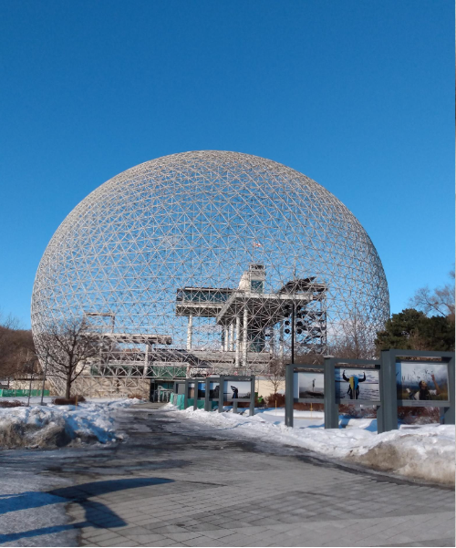
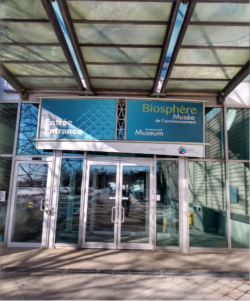
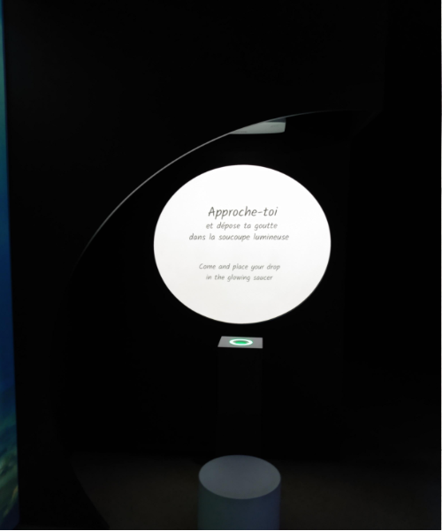
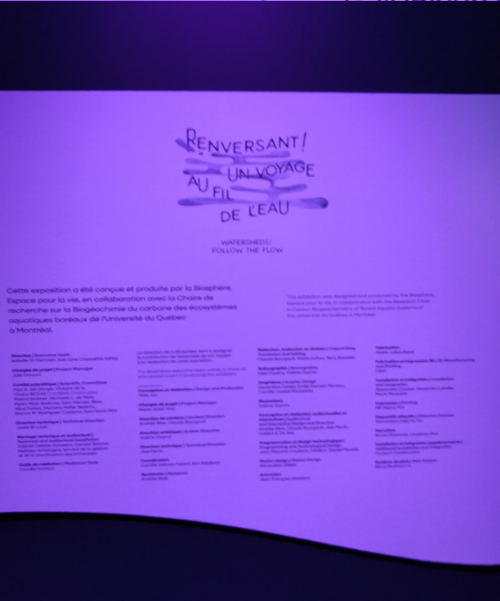
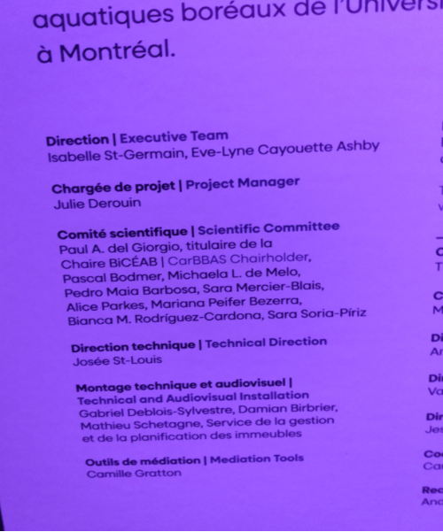
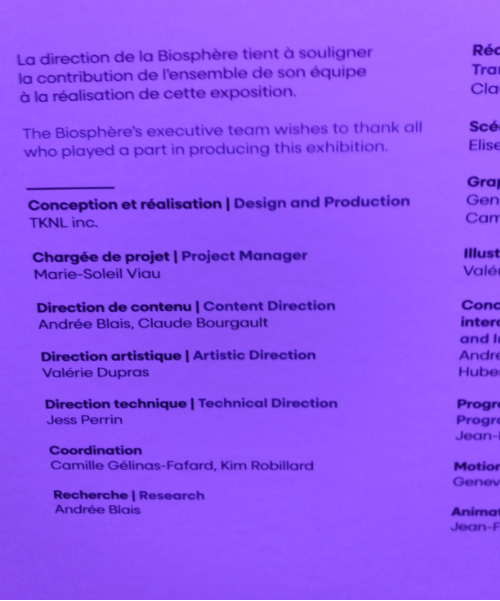
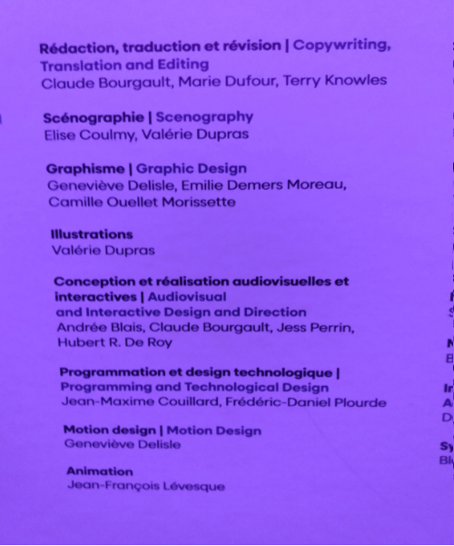
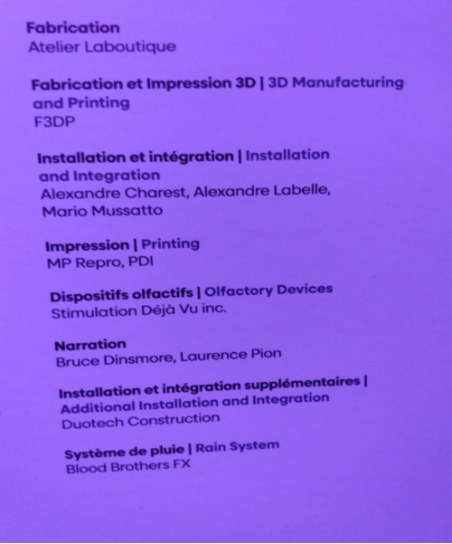
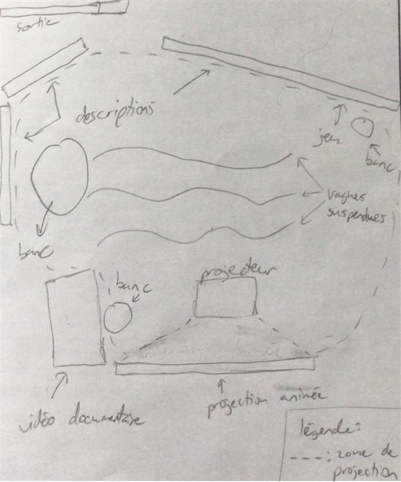
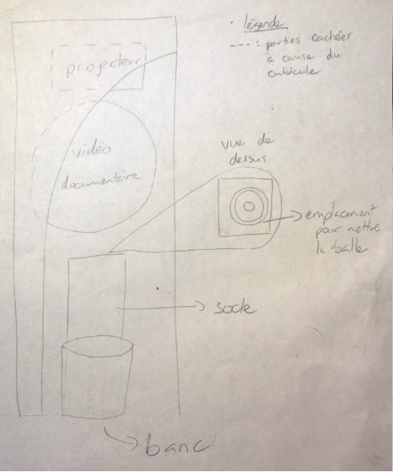

# Exposition  Renversant! Un voyage au fil de l'eau

**Biosphère**

> Photo en face de la Biosphère

> Photo en face de L'entrée de la Biosphère

*(Exposition temporaire et intérieur)

*Date de visite : 1er mars 2026*

## "Module Voyage au fil de l'eau"

**Par TKNL Expériences**

Date de réalisation: 2024

### Description de l'oeuvre

Renversant! Un voyage au fil de l'eau est une exposition immersive et interactive présentée à la Bisosphère de Montréal, conçue pour les familles et les jeunes de 8 ans et plus. Elle invite les visiteurs à parcourir un bassin versant en explorant les écosystèmes aquatiques à travers une approche sensorielle complète: vue, ouïe, toucher et odorat.

Le dispositif suivant utilise la vue, le toucher et l'ouÏe pour nous immerger dans un mini-documentaire sur la vie aquatique. Il s'agit d'un anneau lumineux interactif, où les visiteurs sont invités à "déposer leur goutte d'eau" dans la soucoupe lumineuse. Ce geste déclenche le mini-documentaire sur les écosystèmes aquatiques. Les "gouttes d'eau" sont des balles tactiles remises aux visiteurs à l'entrée, qu'ils utilisent pour interagir avec les différents dispositifs tout au long du parcours. Chaque interaction permet de découvrir des aspects scientifiques, sensoriels et écologiques liés à l'eau.

Type d'installation: contemplative, immersive et intéractive

> Photo du dispositif

Personnes qui ont participé à l'oeuvre:

> Photo du cartel qui montre tous les collaborateurs en entier

> Photo des cartels qui montre tous les collaborateurs par colones

### Mise en espace:

> Croquis de la région où se trouve le dispositif dans l'exposition

> Croquis du dispositif

Élément nécessaires à la mise en exposition: cubicule, banc, projecteur.

### Composantes et techniques

Vidéo du documentaire, balle, socle avec l'emplacement pour mettre la balle, écran, son stéréo.

### Expérience vécue

J'ai pris une "goutte d'eau" à l'entrée de l'exposition et je l'ai placé dans la soucoupe lumineuse. J'ai ensuite regardé le mini-documentaire sur l'écosystème aquatique du début jusqu'à la fin.

### Appréciation

J'ai aimé l'immersion sensorielle (lumière, sons, toucher) qui transporte le visiteur dans les écosytèmes aquatiques et l'interactivité avec la balle-goutte qui crée un sentiment de participation active. Le mini-documentaire était très informatif et j'apprenais beaucoup de nouvelles informations que j'ignorais (ex: seulement un faible pourcentage sur des millions d'oeufs d'anguilles d'Amérique survivent).

Ce que j'ajouterais c'est des défis collaboratifs pour encourager les échanges entre les familles. Je proposerais aussi des mini-jeux ou des défis delon l'âge ou le niveau de connaissance pour éviter que les plus jeunes ou les plus avancés s'ennuient.

### Références

Photos et vidéo prises par Eliza Tomoiaga

**[site web du l'eau d'exposition](https://calendrier.espacepourlavie.ca/renversant-un-voyage-au-fil-de-leau)**

> Photo du cartel qui montre tous les collaborateurs en entier

> Photo des cartels qui montre tous les collaborateurs par colones

