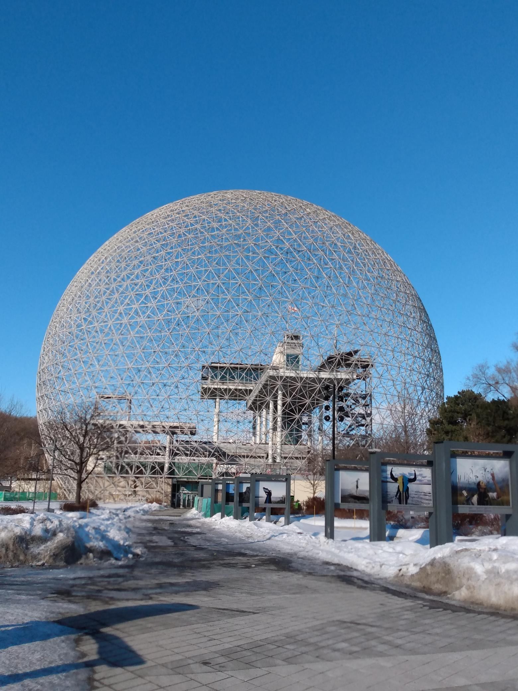
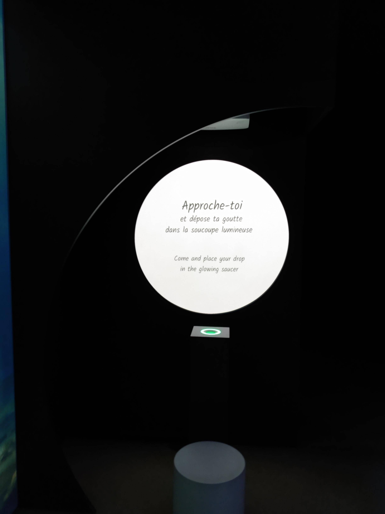

# Exposition  Renversant! Un voyage au fil de l'eau

**Biosphère**

*Photo en face de la Biosphère*

*(Exposition temporaire et intérieur)*

*Date de visite : 1er mars 2026*

## Renversant! Un voyage au fil de l'eau

**Par TKNL Expériences**

Date de réalisation: 2024

### Description de l'oeuvre

Type d'installation: contemplative, immersive et intéractive

*Photo du dispositif*

*Photo derrière de l'exposition*

Personnes qui ont participé à l'oeuvre:

*Photo du cartel qui montre tous les collaborateurs*

### Mise en espace:

*Croquis de l'exposition*

Élément nécessaires à la mise en exposition: mur, poufs, socle, écouteurs, lumières, cartel.

### Composantes et techniques

Installation vidéo multimédia vidéo à trois canaux sur écrans LCD, son stéréo; impression numérique sur papier; structure en bois et grille métallique; lampes annulaires, chariot de rangement, drapeau en polyester imprimé, marchandises (porte-clés, t-shirts, gobelets, coussins, bracelets).

Dossier de recherche: images, nuages de mots tirés du jeu de données de tweets, captures d'écrans.

*Photo du livre de références*

 
*Photo d'un des personnages*

 
*Photo d'un jeu de données de tweets*

*Photo d'une capture d'écran d'une converstation entre deux personnages*

### Expérience vécue

Je regardais les différents marchandises et lisais chaques posters exposés à l'avant de l'exposition. Je me suis ensuite assis sur un des poufs avec un des écouteurs sur mes oreilles pour écouter la vidéo qui était exposé à l'arrière du mur de l'exposition.

### Appréciation

Ce qui m’a plu dans SlopPsyopRealism (plea$e subscribe) de Francisco González-Rosas, c’est surtout la pertinence du sujet. L’oeuvre parle directement de notre réalité actuelle : la surconsommation d’images, l’algorithme, les discours politiques en ligne et la confusion entre vrai et faux. J’ai trouvé fort le fait que l’artiste ne cherche pas à embellir cette réalité, mais au contraire à la montrer dans toute sa saturation et son excès.

Cependant, certains aspects me laissent plus partagée. L’esthétique très chaotique et saturée peut devenir difficile à regarder sur une longue durée. Pour mes propres créations, je ne souhaiterais peut-être pas pousser autant l’intensité visuelle, car je préfère laisser davantage d’espace au spectateur pour respirer et réfléchir. Je pourrais aborder un thème similaire, mais avec un contraste plus marqué entre le calme et la saturation, afin de créer une tension plus progressive plutôt qu’un bombardement constant.

### Références

Images et photos prises par Eliza Tomoiaga

