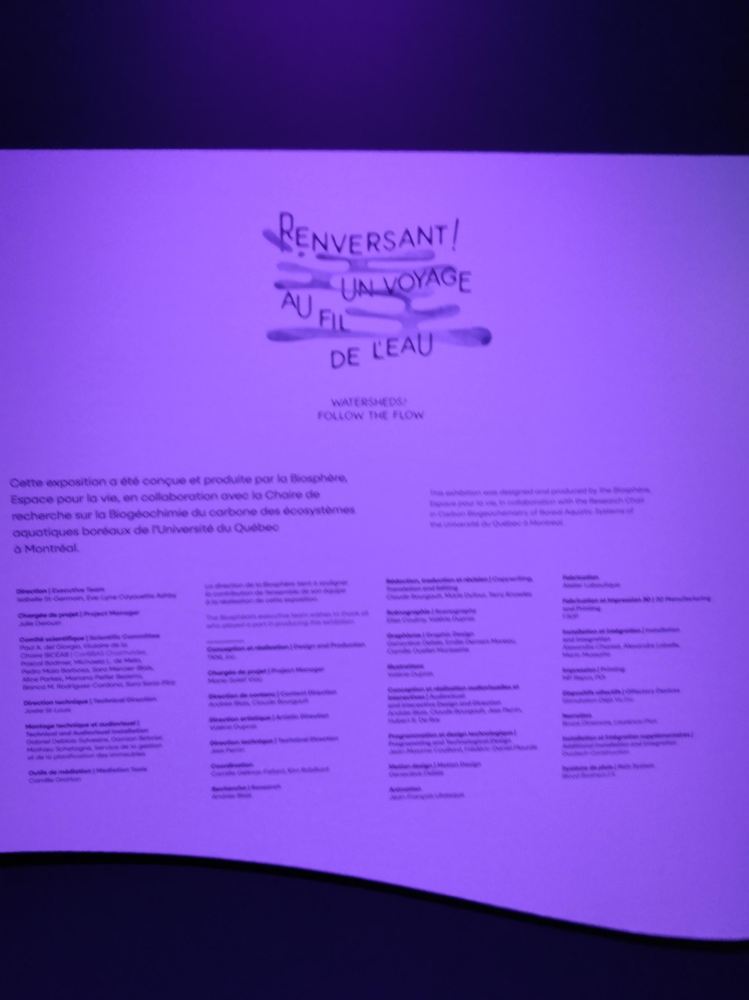
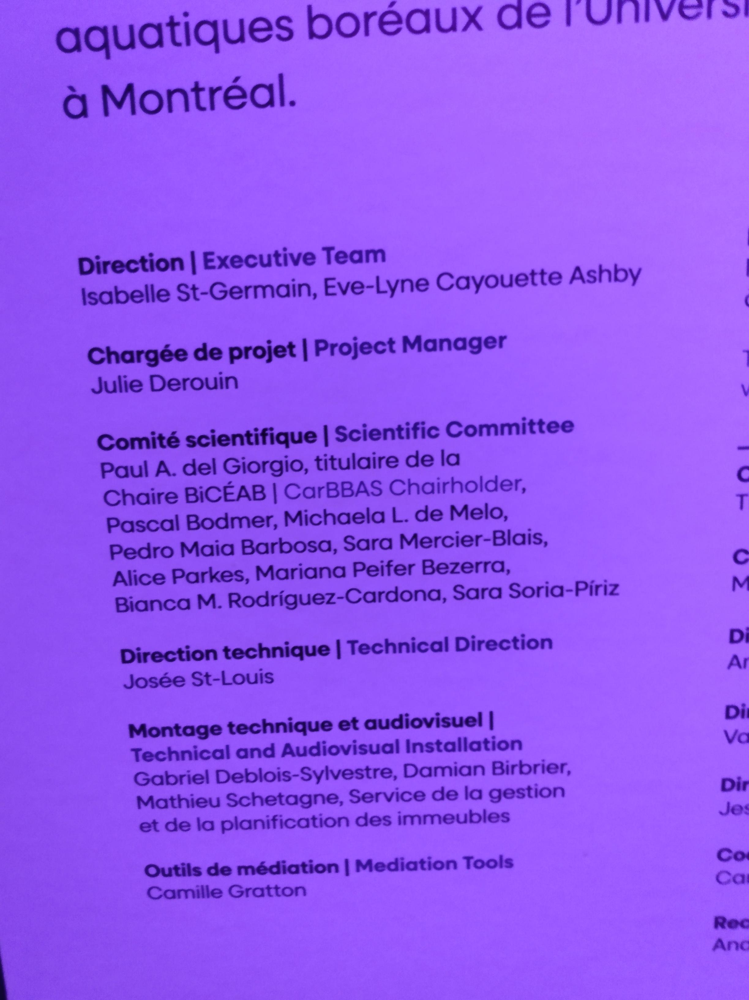
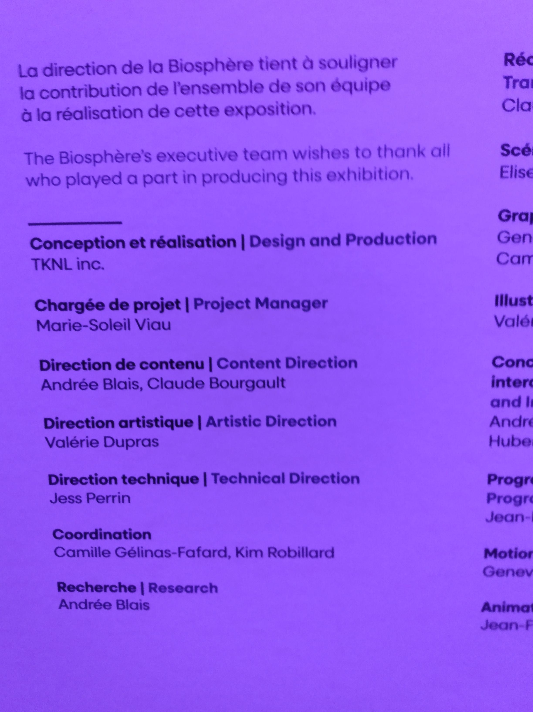
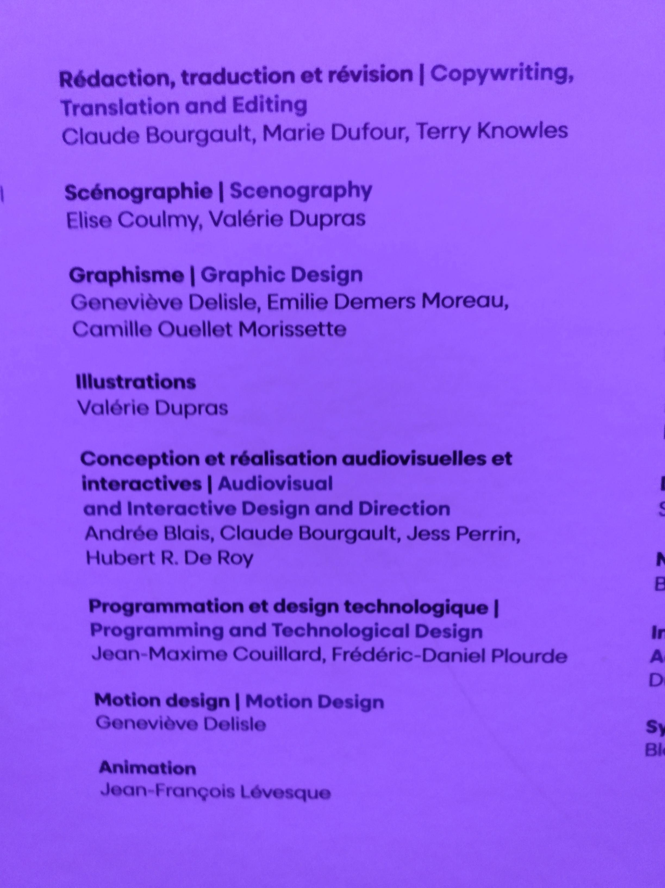
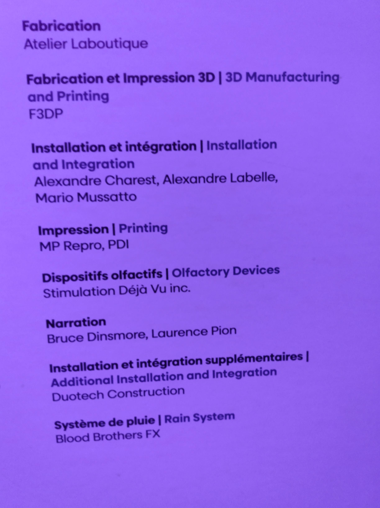
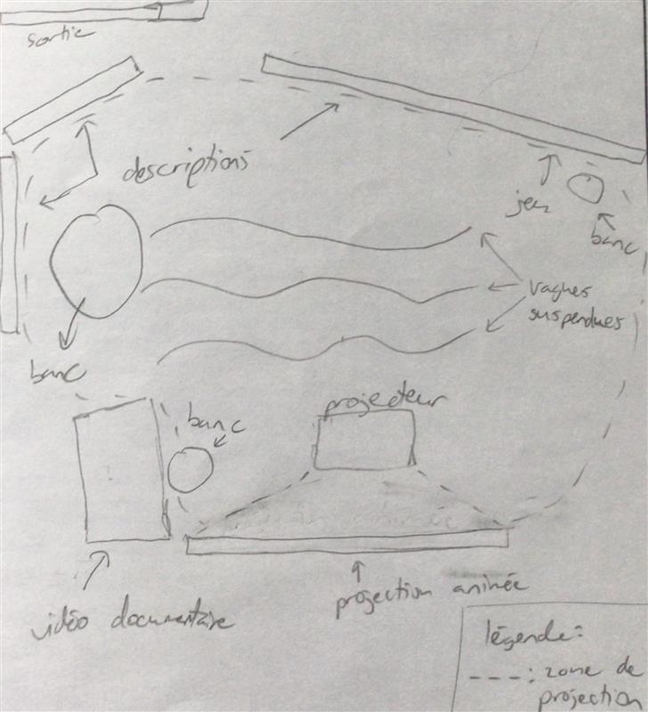
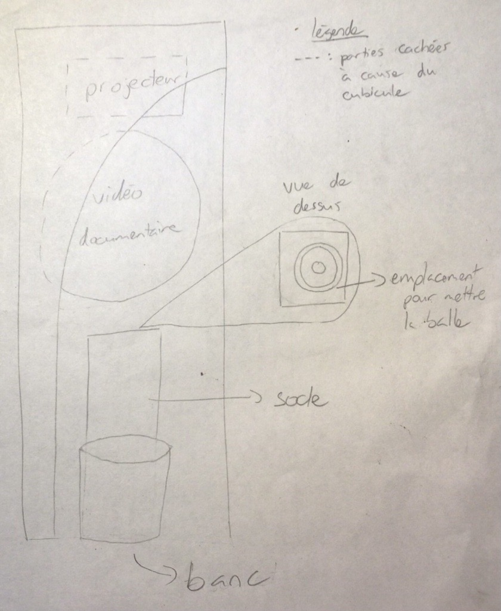

# Exposition  Renversant! Un voyage au fil de l'eau

**Biosphère**

*Photo en face de la Biosphère*

*(Exposition temporaire et intérieur)*

*Date de visite : 1er mars 2026*

## Renversant! Un voyage au fil de l'eau

**Par TKNL Expériences**

Date de réalisation: 2024

### Description de l'oeuvre

Type d'installation: contemplative, immersive et intéractive

*Photo du dispositif*

*Video de comment marche le dirspositif*

Personnes qui ont participé à l'oeuvre:

*Photo du cartel qui montre tous les collaborateurs en entier*

*Photo des cartels qui montre tous les collaborateurs par colones*

### Mise en espace:

*Croquis de l'exposition*

*Croquis de l'exposition*

Élément nécessaires à la mise en exposition: cubicule, banc, projecteur.

### Composantes et techniques

Vidéo du documentaire, balle, socle avec l'emplacement pour mettre la balle, écran, son stéréo.

### Expérience vécue

### Appréciation

### Références

Photos et vidéo prises par Eliza Tomoiaga

